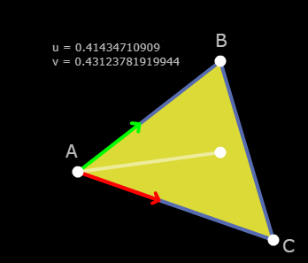

[toc]


参考[1]的话比我看得其他几篇文章更加的清晰，所以可以直接看它就可以了。

# 方法一：Same Side

## 代码实现
参考[1]，用的是Eigen库

```cpp
static bool SameSide(const Vector3f& p1, const Vector3f& p2, const Vector3f& a, const Vector3f& b)
{
    Vector3f ab = b - a;
    Vector3f ap1 = p1 - a;
    Vector3f cp1 = ab.cross(ap1);
	Vector3f ap2 = p2 - a;
    Vector3f cp2 = ab.cross(ap2);
    if (cp1.dot(cp2) >= 0)
        return true;
    else
        return false;
}

static bool IsInsideTriangle(Vector3f& p, const Vector3f* _v)
{   
    if (SameSide(p, _v[0], _v[1], _v[2]) && SameSide(p,_v[1], _v[0], _v[2]) && SameSide(p, _v[2], _v[0], _v[1]))
        return true;
    else
        return false;
}
```


# 方法二：重心坐标法
参考[1]，比方法一更加高效。**简单测了一下，方法二比方法一快了一倍！！！**

```lua
So remember that the three points of the triangle define a plane in space. Pick one of the points and we can consider all other locations on the plane as relative to that point. Let's go with A -- it'll be our origin on the plane. Now what we need are basis vectors so we can give coordinate values to all the locations on the plane. We'll pick the two edges of the triangle that touch A, (C - A) and (B - A). Now we can get to any point on the plane just by starting at A and walking some distance along (C - A) and then from there walking some more in the direction (B - A).

With that in mind we can now describe any point on the plane as

    P = A + u * (C - A) + v * (B - A)
Notice now that if u or v < 0 then we've walked in the wrong direction and must be outside the triangle. Also if u or v > 1 then we've walked too far in a direction and are outside the triangle. Finally if u + v > 1 then we've crossed the edge BC again leaving the triangle.
```



                           （图1）

## 重心坐标


看上面的描述，那么任意点\$P\$可以用下面这个表达式描述：

$P = A + u * (C - A) + v * (B - A)$


其中，（u,v）就是点P在三角形ABC的重心坐标表示


## 通过重心坐标判断
通过图(1)很容易看出来

**（1）如果u < 0 或者 v < 0，那么向量都朝相反方向，那么P点肯定在三角形外**

**（2）同理，如果u > 1 或者 v > 1，那么P点肯定在三角形外**

**（3）如果u + v > 1，那么P点就会超过BC边了，那么也在三角形外**


那么可以说当点P在边BC上，那么u+v = 1;这里可以简单推导一下：


很简单，根据相似三角形原理，可以很容易证明了

$$
\begin{align}
已知 \\
\vec{AP} &= u\vec{AC} + v\vec{AB}  \\
可以得到 \\
EP &// AC \\
那么可以知道 \\
\triangle{ABC}&和\triangle{EBP}相似 \\
\frac{|\vec{BE}|}{|\vec{AB}|} &= \frac{|\vec{EP}|}{|\vec{AC}|} \\
\frac{(1-v)|\vec{AB}|}{ |\vec{AB}|} &=\frac{ u|\vec{AC}| }{ |\vec{AC}|} \\
1-v &= u \\
u + v &= 1 
\end{align}
$$


## 求重心坐标
```CPP
static bool IsInsideTriangle(Vector3f& p, const Vector3f* _v)
{ 
    P = A + u * (C - A) + v * (B - A)       // Original equation
    (P - A) = u * (C - A) + v * (B - A)     // Subtract A from both sides
    v2 = u * v0 + v * v1                    // Substitute v0, v1, v2 for less writing
    
    // We have two unknowns (u and v) so we need two equations to solve
    // for them.  Dot both sides by v0 to get one and dot both sides by
    // v1 to get a second.
    (v2) . v0 = (u * v0 + v * v1) . v0
    (v2) . v1 = (u * v0 + v * v1) . v1

    // Distribute v0 and v1
    v2 . v0 = u * (v0 . v0) + v * (v1 . v0)
    v2 . v1 = u * (v0 . v1) + v * (v1 . v1)

    // Now we have two equations and two unknowns and can solve one 
    // equation for one variable and substitute into the other.  Or
    // if you're lazy like me, fire up Mathematica and save yourself
    // some handwriting.
    Solve[v2.v0 == {u(v0.v0) + v(v1.v0), v2.v1 == u(v0.v1) + v(v1.v1)}, {u, v}]
    u = ((v1.v1)(v2.v0)-(v1.v0)(v2.v1)) / ((v0.v0)(v1.v1) - (v0.v1)(v1.v0))
    v = ((v0.v0)(v2.v1)-(v0.v1)(v2.v0)) / ((v0.v0)(v1.v1) - (v0.v1)(v1.v0))
}
```


## 代码实现
用的是Eigen库

```cpp
        Vector3f v0 = _v[2] - _v[0];
        Vector3f v1 = _v[1] - _v[0];
        Vector3f v2 = p - _v[0];

        // Compute dot products
        float dot00 = v0.dot(v0);
        float dot01 = v0.dot(v1);
        float dot02 = v0.dot(v2);
        float dot11 = v1.dot(v1);
        float dot12 = v1.dot(v2);

        // Compute barycentric coordinates
        float invDenom = 1 / (dot00 * dot11 - dot01 * dot01);
        float u = (dot11 * dot02 - dot01 * dot12) * invDenom;
        float v = (dot00 * dot12 - dot01 * dot02) * invDenom;

        // Check if point is in triangle
        return (u >= 0) && (v >= 0) && (u + v < 1);
```
# 参考
\[1\]\[\]([https://blackpawn.com/texts/pointinpoly/](https://blackpawn.com/texts/pointinpoly/))

\[2\]\[geogebra\]([https://www.geogebra.org/calculator/smuvmtm6](https://www.geogebra.org/calculator/smuvmtm6))

\[3\]\[stackoverflow\]([https://stackoverflow.com/questions/2049582/how-to-determine-if-a-point-is-in-a-2d-triangle](https://stackoverflow.com/questions/2049582/how-to-determine-if-a-point-is-in-a-2d-triangle))

\[4\]\[判断点是否在三角形内\]([https://blog.csdn.net/wkl115211/article/details/80215421](https://blog.csdn.net/wkl115211/article/details/80215421))