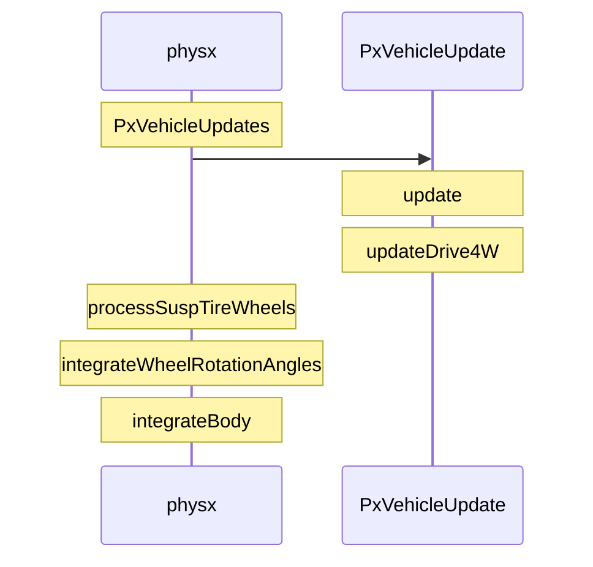

@[toc]
把PhysX vehicle接到我们miniclient中，发现按w键，车子要好半天才启动起来~


# 经历
## 1.各种修改数据，阻尼，弹簧啥的
参考[1]

结果：无果

## 2.跟源代码，查看数据
跟踪的一些数据表明，确定引擎是有动力的=

**小结：**

(1) 从轮子的旋转上看就发现miniclient中车子一开始轮子旋转几乎是0，看四元素的x分量。因为车子是z方向，轮子也是，所以是绕x轴旋转

```
	# computeWheelLocalPoses() 这里代码很好理解，就是根据旋转的角度算这个轮子新的四元数，然后x、y和z分别算的
	  //Compute the transform of the wheel shapes. 
	  const PxVec3 pos=cmOffset+wheelsSimData.getWheelCentreOffset(i)-wheelsSimData.getSuspTravelDirection(i)*jounce;
	  const PxQuat quat(wheelQueryResults[i].steerAngle, gUp);
	  const PxQuat quat2(camberAngle, quat.rotate(forward));
	  const PxQuat quat3=quat2*quat;
	  const PxQuat quat4(rotAngles[i],quat3.rotate(gRight));
	  const PxTransform t(pos,quat4*quat3);
```

(2)可以看出来miniclient按键后一段时间forwardSpeed还是接近0，就等于没动

```
	# processSuspTireWheels()
    //Now compute the speeds along each of the tire axes.
    const PxF32 tireLongSpeed=wheelBottomVel.dot(tireLongDir);
    const PxF32 tireLatSpeed=wheelBottomVel.dot(tireLatDir);

    //Store the forward speed (having a local copy avoids lhs).
    forwardSpeeds[i]=tireLongSpeed;

	# integrateWheelRotationAngles() 这里的wheelSpeed就是forwardSpeed
  	PxF32 wheelOmega=wheelSpeeds[j];
  	if(jounces[j] > -vehSuspWheelTire4SimData.getSuspensionData(j).mMaxDroop &&	//(i) wheel touching ground
	   false==isBrakeApplied[j] &&	//(ii) no brake applied
	   0.0f==diffTorqueRatios[j]*KG*engineDriveTorque &&	//(iii) no drive torque applied
	   PxAbs(forwardSpeeds[j])<gThresholdForwardSpeedForWheelAngleIntegration)	//(iv) low speed
 	 {
	   const PxF32 recipWheelRadius=vehSuspWheelTire4SimData.getWheelData(j).getRecipRadius();
	   const PxF32 alpha=PxAbs(forwardSpeeds[j])*gRecipThresholdForwardSpeedForWheelAngleIntegration;
	   wheelOmega = (forwardSpeeds[j]*recipWheelRadius)*(1.0f-alpha) + wheelOmega*alpha;
	  }

	  PxF32 newRotAngle=wheelRotationAngles[j]+wheelOmega*timestep;
	  //Clamp the wheel rotation angle to a range (-10*pi,10*pi) to stop it getting crazily big.
  newRotAngle=physx::intrinsics::fsel(newRotAngle-10*PxPi, newRotAngle-10*PxPi, physx::intrinsics::fsel(-newRotAngle-10*PxPi, newRotAngle + 10*PxPi, newRotAngle));
	  wheelRotationAngles[j]=newRotAngle;
```

(3)可以看到影响forwardSpeed的carChassisLinVel 一开始传进来的就是0
(4)但是调试代码发现carChassisLinVel是会影响的，结果值是正常的

```
	# integrateBody()
	PX_INLINE void integrateBody
(const PxF32 inverseMass, const PxVec3& invInertia, const PxVec3& force, const PxVec3& torque, const PxF32 dt,
 PxVec3& v, PxVec3& w, PxTransform& t)
	{
	 //Integrate linear velocity.
	 v+=force*(inverseMass*dt);
```

可以看到*carChassisLinVel*(也就是函数中的v向量)，是受force，inverseMass和dt三个影响的，结果这三个是正常的，算出来的值也是正确的，然后设置到actor中

(5)问题出在了这个值参与计算的时候是从开始取的，然后这个值就是很小的一个值

```
# updateDrive4W()
carChassisLinVel = vehActor->getLinearVelocity();
```

后面数据断点问题大概是PhysX的线程中会改vehActor->setLinearVelocity改的。不是很好看，感觉是simulate然后fetchResult之后更改的

```
# syncState()
 if ((bufferFlags & Buf::BF_LinearVelocity) == 0)
  mBufferedLinVelocity = mBodyCore.getLinearVelocity();
```


* 时序图记录一下


**说明：**
* PxVehicleUpdate::updateDrive4W一开始就取了*carChassisLinVel*
```
carChassisLinVel = vehActor->getLinearVelocity();
```

* processSuspTireWheels根据carChassisLinVel算出来forwardSpeed

```
    //Now compute the speeds along each of the tire axes.
    const PxF32 tireLongSpeed=wheelBottomVel.dot(tireLongDir);
    const PxF32 tireLatSpeed=wheelBottomVel.dot(tireLatDir);

    //Store the forward speed (having a local copy avoids lhs).
    forwardSpeeds[i]=tireLongSpeed;
```

* integrateWheelRotationAngles根据forwardSpeed算出来每个轮子的旋转角度（按x轴的）

```
  PxF32 wheelOmega=wheelSpeeds[j];
  if(jounces[j] > -vehSuspWheelTire4SimData.getSuspensionData(j).mMaxDroop &&	//(i) wheel touching ground
   false==isBrakeApplied[j] &&	//(ii) no brake applied
   0.0f==diffTorqueRatios[j]*KG*engineDriveTorque &&	//(iii) no drive torque applied
   PxAbs(forwardSpeeds[j])<gThresholdForwardSpeedForWheelAngleIntegration)	//(iv) low speed
  {
   const PxF32 recipWheelRadius=vehSuspWheelTire4SimData.getWheelData(j).getRecipRadius();
   const PxF32 alpha=PxAbs(forwardSpeeds[j])*gRecipThresholdForwardSpeedForWheelAngleIntegration;
   wheelOmega = (forwardSpeeds[j]*recipWheelRadius)*(1.0f-alpha) + wheelOmega*alpha;
  }

  PxF32 newRotAngle=wheelRotationAngles[j]+wheelOmega*timestep;
  //Clamp the wheel rotation angle to a range (-10*pi,10*pi) to stop it getting crazily big.
  newRotAngle=physx::intrinsics::fsel(newRotAngle-10*PxPi, newRotAngle-10*PxPi, physx::intrinsics::fsel(-newRotAngle-10*PxPi, newRotAngle + 10*PxPi, newRotAngle));
  wheelRotationAngles[j]=newRotAngle;
  correctedWheelSpeeds[j]=wheelOmega;
```

* integrateBody重新计算*carChassisLinVel*

```
 //Integrate linear velocity.
 v+=force*(inverseMass*dt);
```

然而并没有卵用

## 3.和代码库里面sample例子对比一下代码

跟底层代码太深了，还是不能断定哪里出了问题，感觉载具引擎那边数据没啥问题~。所以，就再回头对比下啊Sample的代码，发现问题出在了档位上面
# 解决

看Sample里面有一段代码，会把车子初始设置为1档

```
   //Set the car back to its rest state.
   vehDrive4W->setToRestState();
   //Set the car to first gear.
   vehDrive4W->mDriveDynData.forceGearChange(PxVehicleGearsData::eFIRST);
```

我这边加了下就可以了，可以了，以了，了~

# 总结
* PhysX vehicle默认是空挡，但是自动挡的时候从空挡到1档会很慢，不知道是不是还有哪里设置的不对

# 参考
[1][官方文档](vehicle-Troubleshooting)