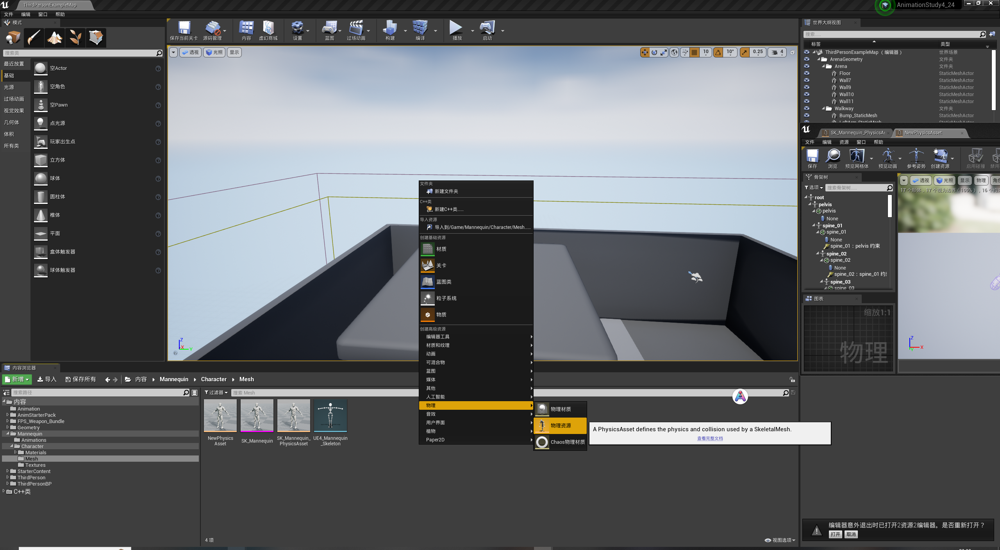
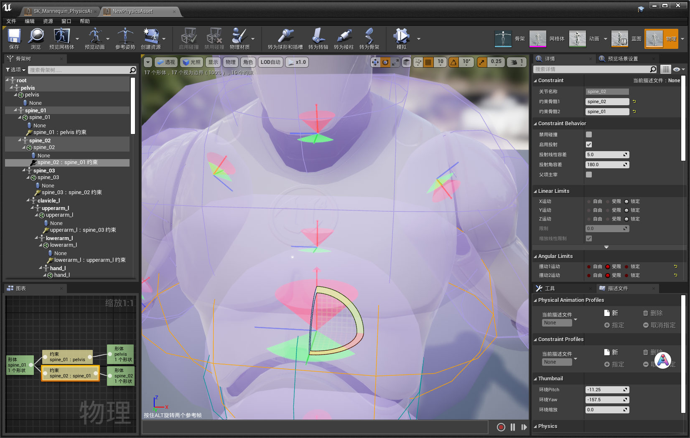
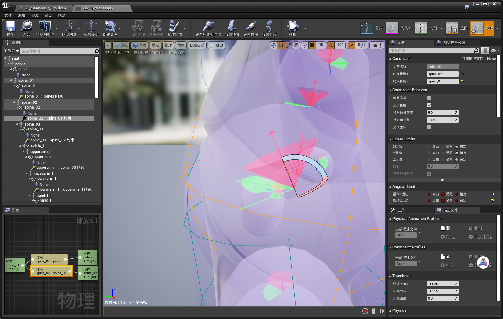

@[toc]

UE4布娃娃约束怎么修改？

# 步骤

## 创建一个物理资产
资源管理器->右键->物理->物理资源

## 选中约束
3D场景中选中，或者左侧面板上选中

## 修改约束

默认约束只有一个坐标系，修改的时候Frame1和Frame2都会同时修改

## 只修改Frame2
**重点：需要按住alt键，选中约束的时候左下角有提示**

这个时候就能看到有两个坐标系了

# 参考
