[toc]
想了解更清楚一点Twist和Swing的Limit


# 学习

带着问题去学习

## 1.Twist和Swing都分别对应什么轴，范围大概是个什么概念？

### Twist

* 绕x轴转动

效果

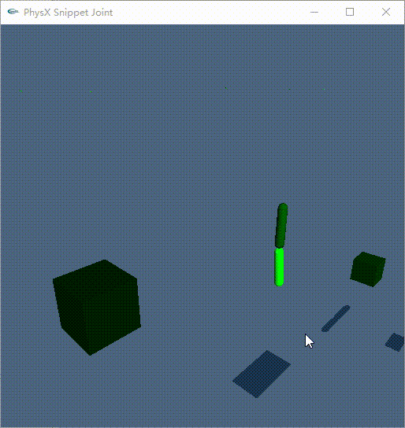

测试代码：

```cpp
// 期望小腿前后摆是Twist决定的
PxD6Joint* CreateDampedD6(PxRigidActor* a0, const PxTransform& t0, PxRigidActor* a1, const PxTransform& t1)
{
	PxD6Joint* j = PxD6JointCreate(*gPhysics, a0, t0, a1, t1);

	j->setConstraintFlag(physx::PxConstraintFlag::eCOLLISION_ENABLED, false);
	j->setConstraintFlag(physx::PxConstraintFlag::eVISUALIZATION, true);
	j->setConstraintFlag(physx::PxConstraintFlag::ePROJECTION, true);

	{
		j->setMotion(PxD6Axis::eSWING1, PxD6Motion::eLOCKED);
		j->setMotion(PxD6Axis::eSWING2, PxD6Motion::eLOCKED);
		j->setMotion(PxD6Axis::eTWIST, PxD6Motion::eLIMITED);

		PxJointLinearLimit sOldLinearLimit = j->getLinearLimit();
		//PxJointLinearLimit l(1.f, PxSpring(-1.f, 0.f));
		//j->setLinearLimit(l);
		PxJointLinearLimit sNewLinearLimit = j->getLinearLimit();

		PxJointLimitCone sOldLimitCone = j->getSwingLimit();
		float fLimitRadian = 60.f / 180.f * PxPi;
		PxJointLimitCone sPxLimitCone(fLimitRadian, fLimitRadian, -1.f);
		j->setSwingLimit(sPxLimitCone);
		PxJointLimitCone sNewLimitCone = j->getSwingLimit();

		PxJointAngularLimitPair sOldTwistLimit = j->getTwistLimit();
		float fTwistLimitRadian = 60.f / 180.f * PxPi;
		// PxJointAngularLimitPair sPxLimitTwist(0, fTwistLimitRadian, -1.f);
		//PxJointAngularLimitPair sPxLimitTwist(-fTwistLimitRadian, 0, -1.f);
		PxJointAngularLimitPair sPxLimitTwist(-fTwistLimitRadian, fTwistLimitRadian, -1.f);
		j->setTwistLimit(sPxLimitTwist);
		PxJointAngularLimitPair sNewTwistLimit = j->getTwistLimit();
	}
	//j->setDrive(PxD6Drive::eSLERP, PxD6JointDrive(0, 1000, FLT_MAX, true));

	return j;
};
```

PVD（调成了左手系）

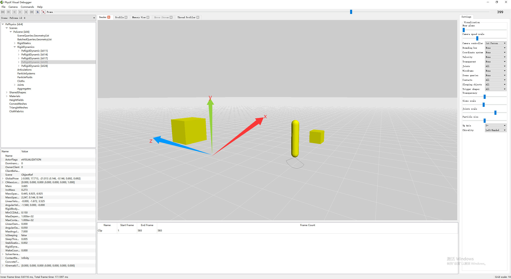

绕x轴旋转的话Twist的范围刚好是[-60, 60]

**这时候有个小重点：这个时候****零点位****是y轴**。可以看下面的一个范围效果

* 范围[0, 120]

代码

```cpp
		float fTwistLimitRadian = 60.f / 180.f * PxPi;
		// [0, 120]
		 PxJointAngularLimitPair sPxLimitTwist(0, fTwistLimitRadian * 2, -1.f);
		//PxJointAngularLimitPair sPxLimitTwist(-fTwistLimitRadian, 0, -1.f);
		// [-60, 60]
		//PxJointAngularLimitPair sPxLimitTwist(-fTwistLimitRadian, fTwistLimitRadian, -1.f);
		j->setTwistLimit(sPxLimitTwist);
```

可以看到PxJointAngularLimitPair本身是可以自己定义范围的，只是UE里面的Twist角度表示的是[-A, A]的意思

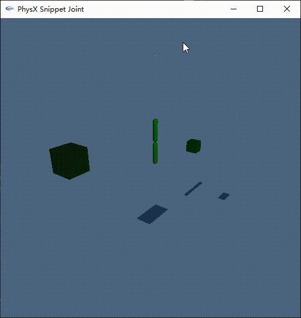

PVD

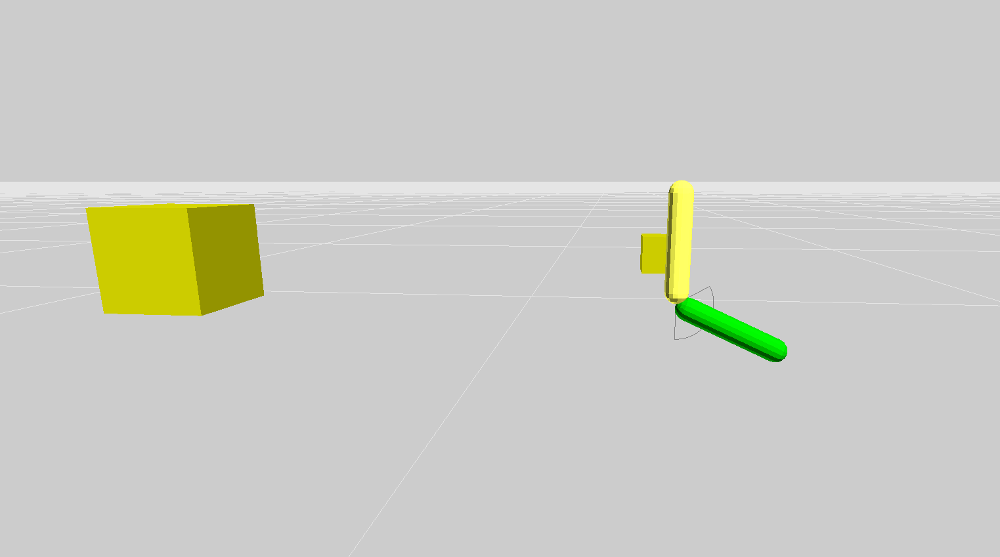

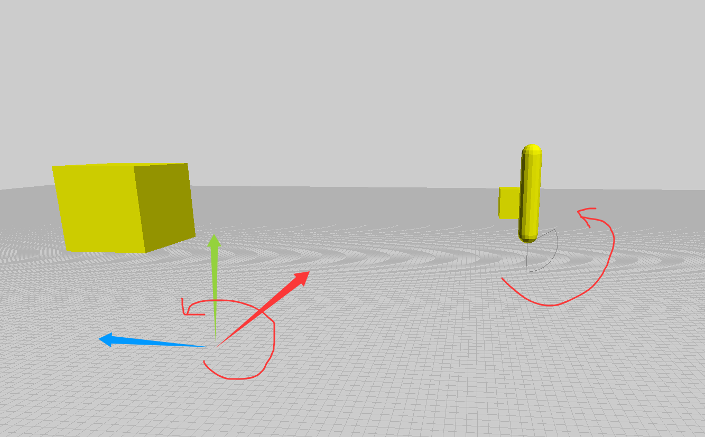

开始是这么理解的：

> 准确来说零点位是y轴负方向，因为子骨骼在下面。如果子骨骼在上面就是另外的样子了

后来发现不对，往后看。

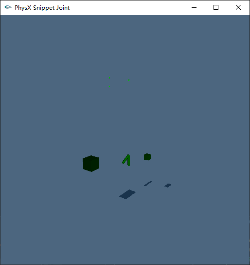

这个图片里面是右手，绕Y轴旋转120°就是正确的。不考虑零点位是Y轴正负方向，就是Y轴，用右手法则带进去就是对的。这个时候你想象一下子骨骼在下面，也是绕Y轴选装，右手法则也是对的。**所谓的零点位不是当前坐标系（子坐标系？）的Y轴正负方向，而是当前子骨骼的Y轴方向（如果子骨骼在下面，那么它的Y轴方向就是向下，如果它在上面，它的Y轴方向就是向上**）

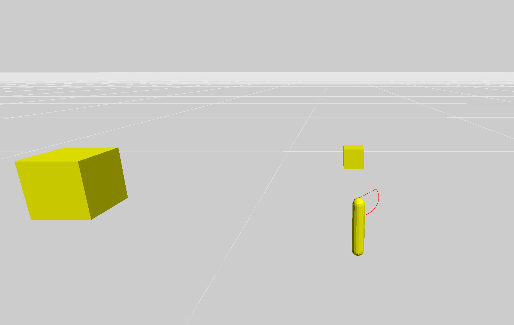

结果和预期竟然不一样\~

* 胶囊体在x轴方向

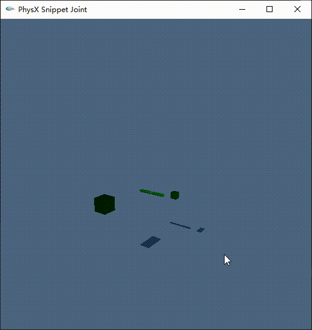

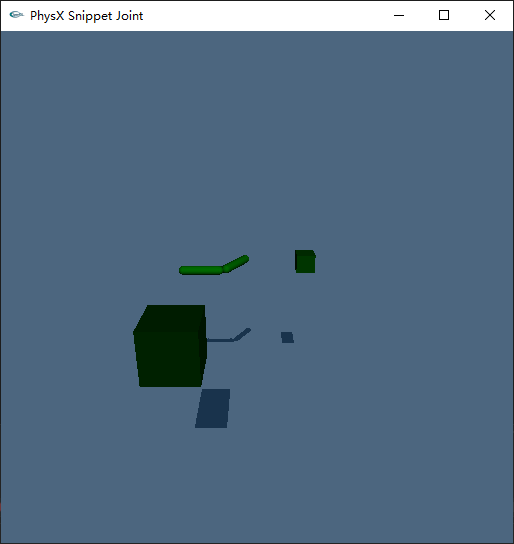

绕Y轴旋转，零点位是x轴负方向的话，好像是对的。胶囊体的零点位确是x轴正方向，也是右手坐标系，绕y轴旋转。两者都看起来是对的，但是感觉有点奇怪

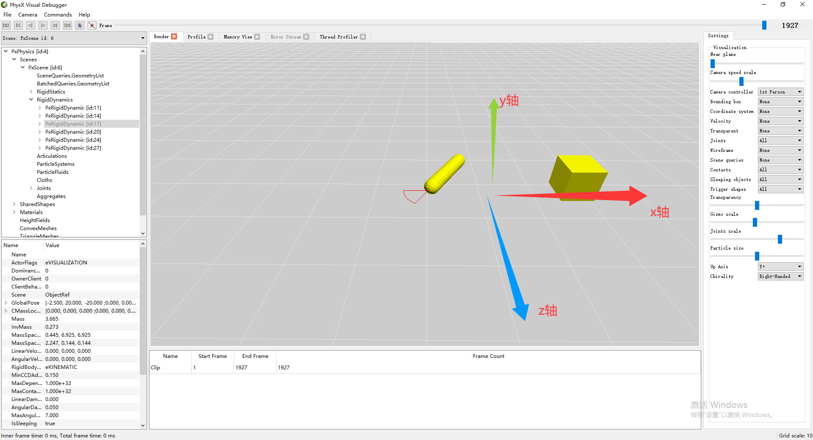

注意：joint的坐标系发生了绕z轴旋转90°的情况

```cpp
	{
		t0.p = PxVec3(separation / 2, 0, 0);
		t1.p = PxVec3(-separation / 2, 0, 0);
		PxQuat qJointZ(PxPi / 2.f, PxVec3(0.f, 0.f, 1.f));
		PxTransform tTransTwist0(PxVec3(0, 0, 0), qJointZ);
		PxTransform tTransTwist1(PxVec3(0, 0, 0), qJointZ);
		//ComputeJointLocalRotation1(t0, tTransTwist0);
		//ComputeJointLocalRotation1(t1, tTransTwist0);

		PxQuat qTwist(-30.f / 180.f * PxPi, PxVec3(1.f, 0.f, 0.f));
		t0.q = qJointZ;
		t1.q = qJointZ;
	}
```

所以joint坐标系应该长这样

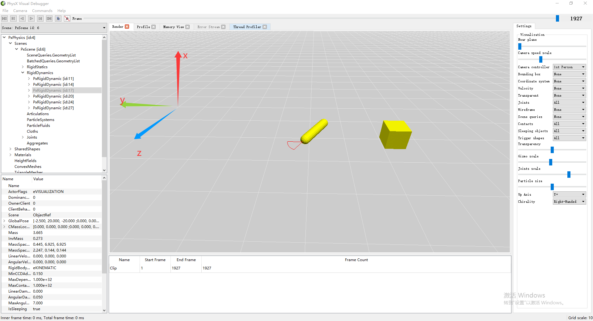

去看前面零点位的定义，再来看这里的零点位：子骨骼自己的方向（子骨骼的位置在joint的位置，长度是朝-y轴方向）是零点位。然后根据右手坐标系，所以如图胶囊体向屏幕里面折过去是对的。如果如果较真的话，这里PVD画的不太对。

PVD

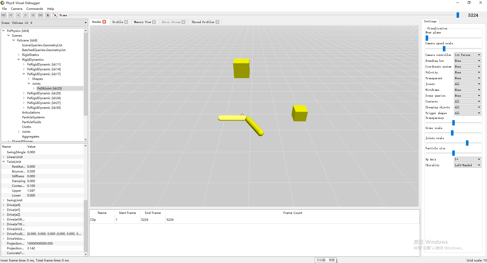

再来看左手系，也是绕轴旋转了90°，这个时候joint的x轴是朝上的，y朝做的，零点位是子骨骼朝向，左手系看图中完全符合

* 初始状态（x轴没有旋转）

x轴没有旋转，所以真正的Twist是转动，绕y轴旋转，如下图所示

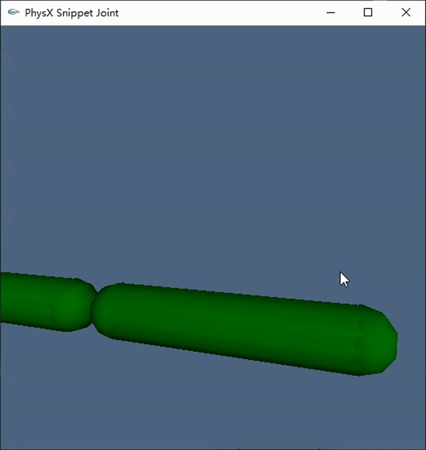

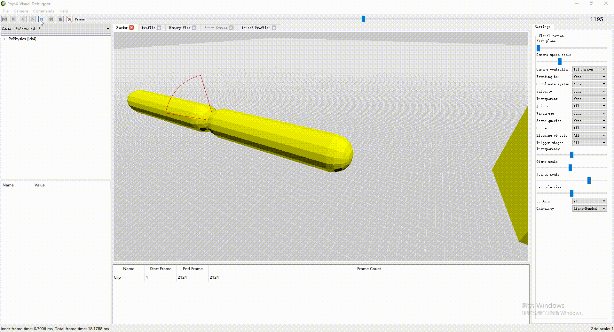

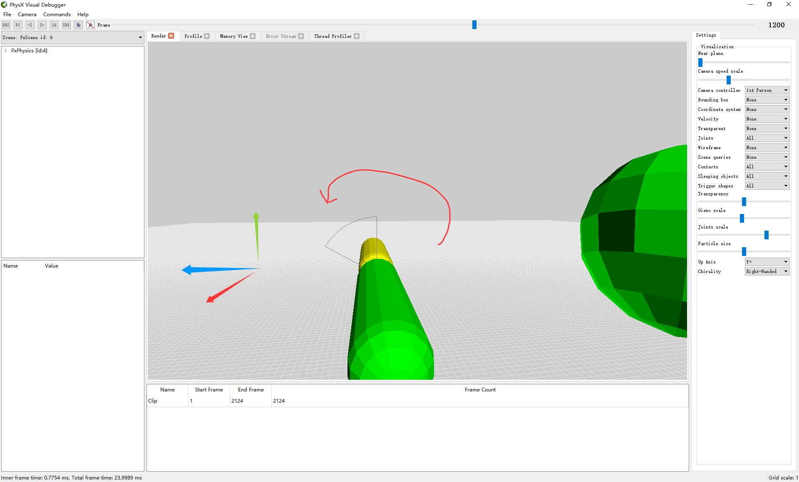

绕x轴旋转，零位点还是y轴方向

### Swing1

* 测试代码

Swing2也是这个，参数不一样而已

```cpp
// 创建一组 Swing 测试，通过 limitSwing1/limitSwing2 手动切换受限方向。
// bVertical=false 时胶囊沿默认 X 轴首尾相连；bVertical=true 时胶囊旋转到 Y 轴方向。
void createChainSwingLimitTest(const PxTransform& t, const PxGeometry& g, PxReal separation, bool bVertical)
{
	bool limitSwing1 = true;
	bool limitSwing2 = false;
	const PxReal swingLimit = 45.f / 180.f * PxPi;
	const PxQuat capsuleRotation = bVertical ? PxQuat(PxPi / 2.f, PxVec3(0.f, 0.f, 1.f)) : PxQuat(PxIdentity);
	const PxVec3 chainAxis = capsuleRotation.rotate(PxVec3(1.f, 0.f, 0.f));

	// 垂直时与 Test1 一致；水平时交换 parent 和 child 的左右位置。
	const PxReal parentOffset = bVertical ? separation / 2.f : -separation / 2.f;
	const PxTransform parentLocal(chainAxis * parentOffset, capsuleRotation);
	const PxTransform childLocal(-chainAxis * parentOffset, capsuleRotation);
	PxRigidDynamic* parent = PxCreateDynamic(*gPhysics, t * parentLocal, g, *gMaterial, 1.0f);
	PxRigidDynamic* child = PxCreateDynamic(*gPhysics, t * childLocal, g, *gMaterial, 1.0f);
	parent->setRigidBodyFlag(PxRigidBodyFlag::eKINEMATIC, true);
	gScene->addActor(*parent);
	gScene->addActor(*child);

	// 位置交换后同步反转水平布局的锚点，确保两个关节帧仍然重合。
	const PxTransform parentFrame(PxVec3(-parentOffset, 0.f, 0.f));
	const PxTransform childFrame(PxVec3(parentOffset, 0.f, 0.f));
	PxD6Joint* joint = PxD6JointCreate(*gPhysics, parent, parentFrame, child, childFrame);
	joint->setConstraintFlag(PxConstraintFlag::eCOLLISION_ENABLED, false);
	joint->setConstraintFlag(PxConstraintFlag::eVISUALIZATION, true);
	joint->setConstraintFlag(PxConstraintFlag::ePROJECTION, true);

	joint->setMotion(PxD6Axis::eX, PxD6Motion::eLOCKED);
	joint->setMotion(PxD6Axis::eY, PxD6Motion::eLOCKED);
	joint->setMotion(PxD6Axis::eZ, PxD6Motion::eLOCKED);
	joint->setMotion(PxD6Axis::eTWIST, PxD6Motion::eLOCKED);
	joint->setMotion(PxD6Axis::eSWING1, limitSwing1 ? PxD6Motion::eLIMITED : PxD6Motion::eLOCKED);
	joint->setMotion(PxD6Axis::eSWING2, limitSwing2 ? PxD6Motion::eLIMITED : PxD6Motion::eLOCKED);
	joint->setSwingLimit(PxJointLimitCone(swingLimit, swingLimit, 0.05f));

	// 给当前允许的 Swing 方向初速度，便于直接观察限制效果。
	PxVec3 localAngularVelocity(0.f, limitSwing1 ? 4.f : 0.f, limitSwing2 ? 4.f : 0.f);
	child->setAngularVelocity(capsuleRotation.rotate(localAngularVelocity));
}
```

#### 水平方向

* 范围是45°

代码设置了Swing1和Swing2，只是Swing2是lock的状态

```cpp
joint->setSwingLimit(PxJointLimitCone(swingLimit, swingLimit, 0.05f));
```

从下面图里可以看出范围是\[-45, 45\]了。**而且基本确定Swing1和Swing2都是limit表示的范围是\[-A, A\]**。

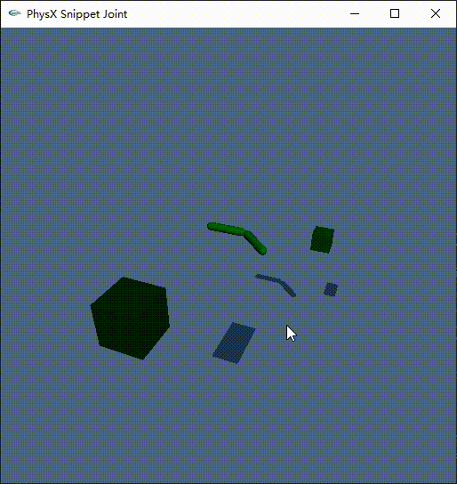

* PVD

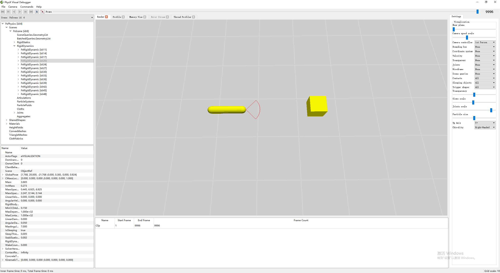

Swing1是绕y轴旋转，零点位是x轴

#### 垂直方向

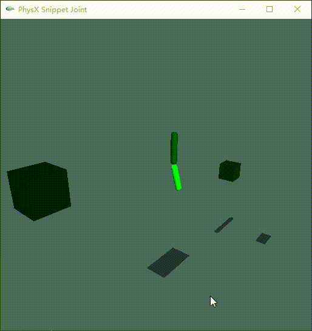

还是绕y轴选装，零点位是x轴方向

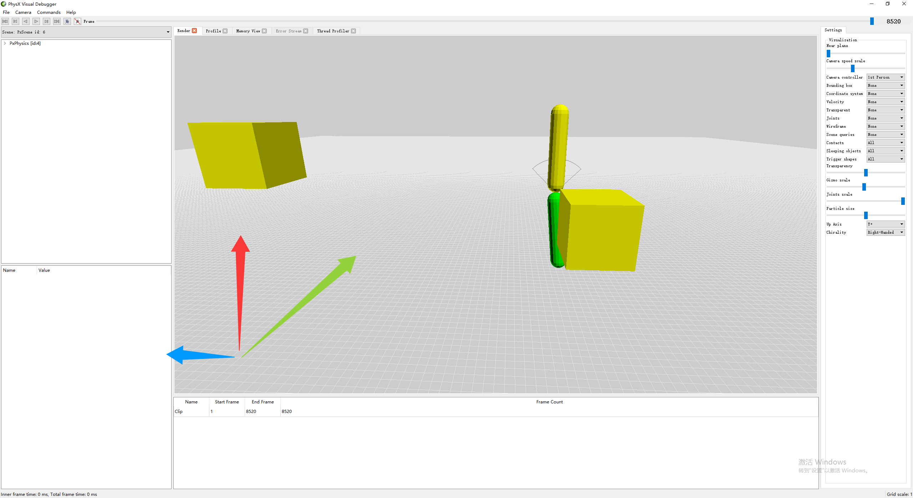

### Swing2

* 效果

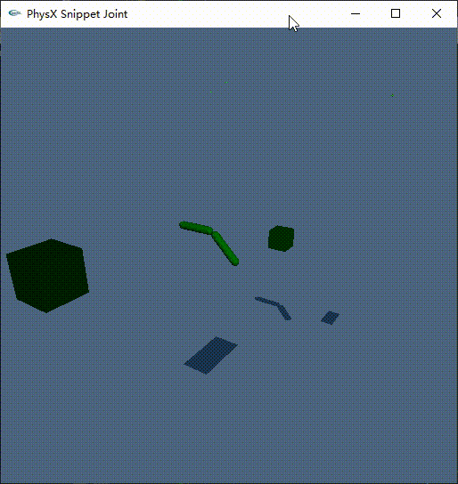

* PVD

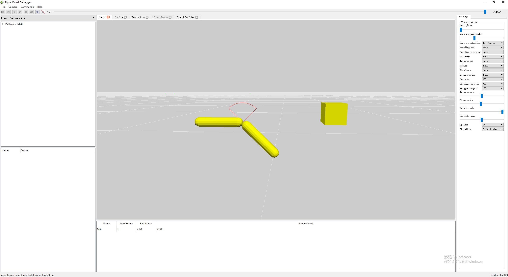

* 绕z轴旋转，零点位是y轴方向

# 参考
